# IntelliSource — ARB Architecture Diagrams
**KPMG ARB Solution Review Specification**  
Solution: KPMG IntelliSource (P2P Intelligence Platform)  
Version: Draft 1.0 | Date: 30 Jun 2026 | Author: Aryan Sharma

> All diagrams correspond to sections in `ARB_Solution_Review_Specification.docx`  
> and use context from `IntelliSource_Filled.docx`.

---

## Section 7.1 — Business Process (To-Be)

> Swimlane BPMN process diagram showing the P2P lifecycle **after** IntelliSource deployment.  
> SAP data flows through the upload module into PostgreSQL; KPI Engine and Anomaly Engine auto-compute metrics; each role accesses role-specific dashboards in real time.

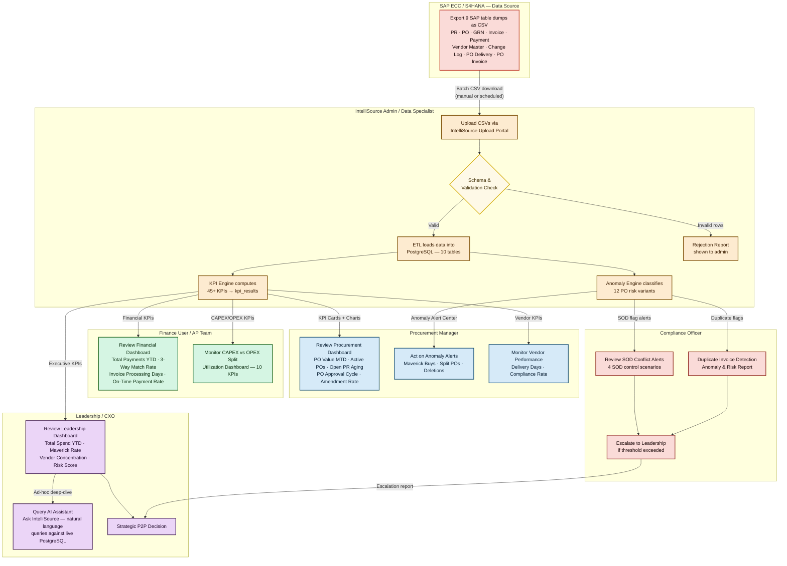

---

## Section 7.2 — Business Process (As-Is)

> Current state P2P process **before** IntelliSource.  
> All analytics are manual — SAP report extracts, Excel pivots, email distribution — with significant delays and blind spots.

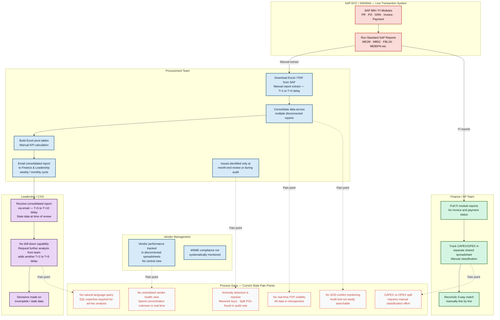

---

## Section 11.3 — Information Architecture – Conceptual Data Model

> Entity-relationship diagram for the 14 PostgreSQL tables in IntelliSource.  
> Core procurement tables linked via purchasing_document (PO key) and vendor code.  
> pr_po_grn_invoice is the denormalised P2P fact table used for lifecycle analytics.

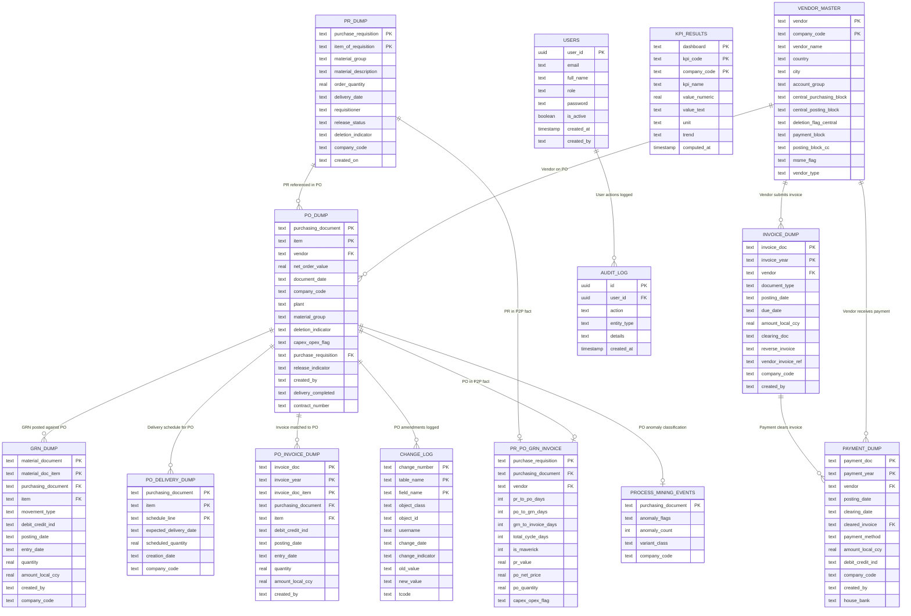

---

## Section 11.4 — Information Architecture – Data / CRUD Model

> Shows which system component performs Create / Read / Update / Delete on each data entity.  
> ETL pipeline owns all source table writes. KPI engine reads source tables and upserts kpi_results.  
> Frontend is read-only via API.

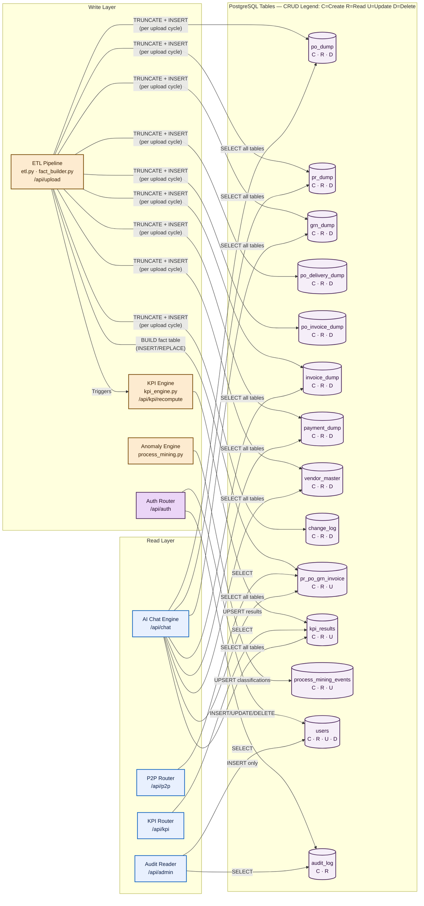

---

## Section 12.1 — Conceptual / Logical Application Architecture

> 5-layer architecture: Users → Presentation (React SPA) → Application API (FastAPI) → Service Layer → Data Layer.  
> External integrations: SAP (file-based CSV) and OpenRouter API (REST HTTPS).

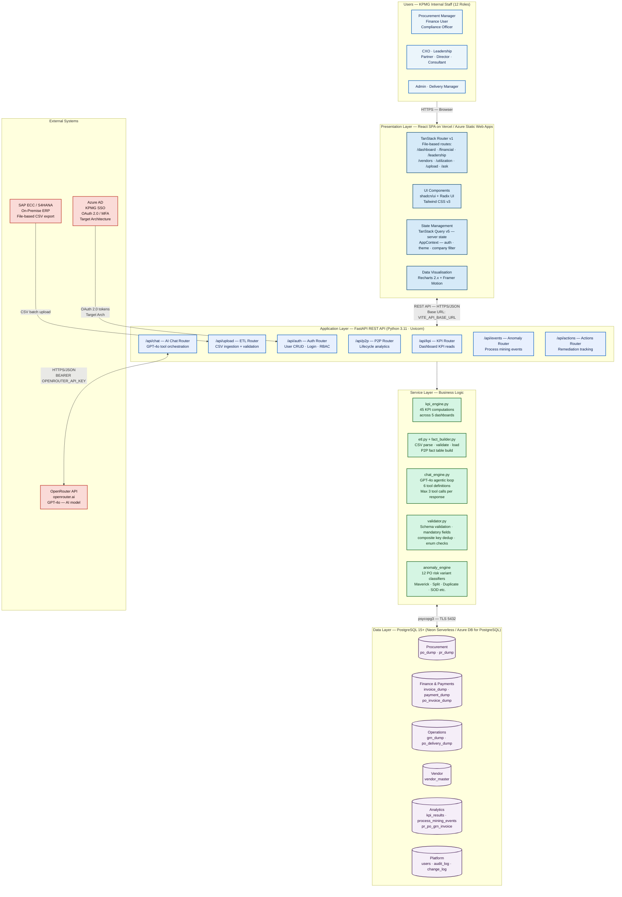

---

## Section 12.4 — Application Architecture – Technology Stack

> Full bill-of-materials showing technology per application component.  
> All frontend and backend dependencies are open-source (MIT/BSD/PSF). Only OpenRouter API and Vercel are commercial.

```mermaid
flowchart LR
    classDef feStyle   fill:#D6EAF8,stroke:#1A5276,color:#0A2035,stroke-width:2px
    classDef beStyle   fill:#D5F5E3,stroke:#1E6823,color:#0A2D0F,stroke-width:2px
    classDef dbStyle   fill:#F5EEF8,stroke:#512E5F,color:#2C0A3A,stroke-width:2px
    classDef aiStyle   fill:#EBD5F7,stroke:#512E5F,color:#200A2A,stroke-width:2px
    classDef devStyle  fill:#FDEBD0,stroke:#7D4E05,color:#3D1F03,stroke-width:2px
    classDef azStyle   fill:#E8F0FE,stroke:#1565C0,color:#0A1E4A,stroke-width:2px

    subgraph FE["Frontend — Presentation Layer"]
        FE1["Language: TypeScript 5.x"]
        FE2["Framework: React 18.x"]
        FE3["Build Tool: Vite 5.x"]
        FE4["Routing: TanStack Router v1\n(file-based, type-safe)"]
        FE5["Server State: TanStack Query v5"]
        FE6["UI Components: shadcn/ui + Radix UI"]
        FE7["Styling: Tailwind CSS v3"]
        FE8["Charts: Recharts 2.x"]
        FE9["Animation: Framer Motion"]
        FE10["Package Manager: Bun 1.x"]
    end

    subgraph BE["Backend — Application Layer"]
        BE1["Language: Python 3.11+"]
        BE2["Framework: FastAPI (latest)"]
        BE3["ASGI Server: Uvicorn (latest)"]
        BE4["DB Adapter: psycopg3 3.x\n(postgresql driver)"]
        BE5["Excel: openpyxl"]
        BE6["HTTP Client: httpx\n(OpenRouter calls)"]
    end

    subgraph DB["Data Layer"]
        DB1["Database: PostgreSQL 15+"]
        DB2["Connection: Thread-local pool\n8 pre-warmed connections"]
        DB3["Cloud: Azure Database\nfor PostgreSQL Flexible Server\n(Target Architecture)"]
        DB4["Pilot: Neon Serverless\nPostgreSQL"]
    end

    subgraph AI["AI / LLM Layer"]
        AI1["Provider: OpenRouter API\n(openrouter.ai)"]
        AI2["Model: GPT-4o\n(openai/gpt-4o)"]
        AI3["Tools: 6 tool definitions\nquery_database · get_kpis\nfind_document · get_anomalies\nget_vendor_info · get_p2p_stage_summary"]
        AI4["Max tool calls: 3 per response"]
    end

    subgraph DEV["DevOps / Hosting"]
        DEV1["Source Control: GitHub\n(kpmg-intelliflow repo)"]
        DEV2["Frontend Host: Vercel CDN\n(auto-deploy on main push)"]
        DEV3["Backend Host: Azure Container Apps\n(Target Architecture)"]
        DEV4["Container Registry:\nAzure Container Registry"]
        DEV5["IDE: VS Code / Cursor"]
    end

    subgraph AZURE["Azure Security & Ops"]
        AZ1["Identity: Azure AD\nSSO + MFA — Target Arch"]
        AZ2["Secrets: Azure Key Vault\nDATABASE_URL · OPENROUTER_API_KEY\nJWT_SECRET"]
        AZ3["WAF: Azure Application Gateway"]
        AZ4["Monitoring: Azure Monitor\n+ Application Insights"]
        AZ5["Logs: Azure Log Analytics\n5-year audit log retention"]
    end

    FE <-->|"REST API HTTPS/JSON"| BE
    BE <-->|"psycopg3 TLS"| DB
    BE <-->|"HTTPS OpenRouter"| AI
    DEV -->|"Deploy & Host"| FE & BE
    AZURE -->|"Secure & Monitor"| BE & DB

    class FE1,FE2,FE3,FE4,FE5,FE6,FE7,FE8,FE9,FE10 feStyle
    class BE1,BE2,BE3,BE4,BE5,BE6 beStyle
    class DB1,DB2,DB3,DB4 dbStyle
    class AI1,AI2,AI3,AI4 aiStyle
    class DEV1,DEV2,DEV3,DEV4,DEV5 devStyle
    class AZ1,AZ2,AZ3,AZ4,AZ5 azStyle
```

---

## Section 13.1 — Integration Architecture – Solution Context

> IntelliSource integration context: SAP (file-based CSV batch), OpenRouter API (REST HTTPS), Azure AD (OAuth 2.0 Target), Vercel CDN (static hosting), GitHub (CI/CD).  
> All integrations are outbound from IntelliSource except SAP CSV push by admin.

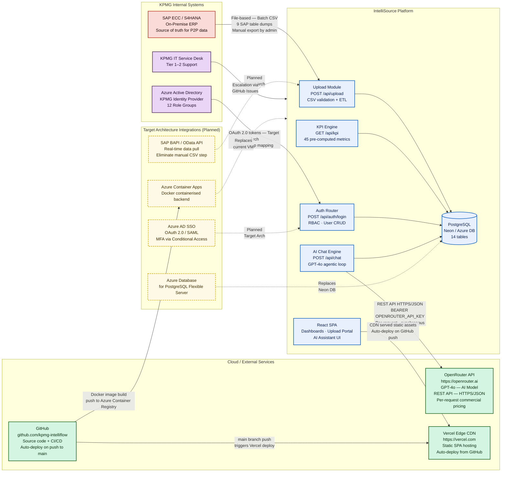

---

## Section 14.1 — Technology Architecture – Hosting / Deployment Architecture (Azure)

> Azure-based target deployment architecture.  
> Internet traffic flows through Azure Front Door / Application Gateway + WAF → Azure Container Apps (FastAPI) → Azure Database for PostgreSQL.  
> Frontend served via Azure Static Web Apps or Vercel CDN. Identity via Azure AD + MFA.

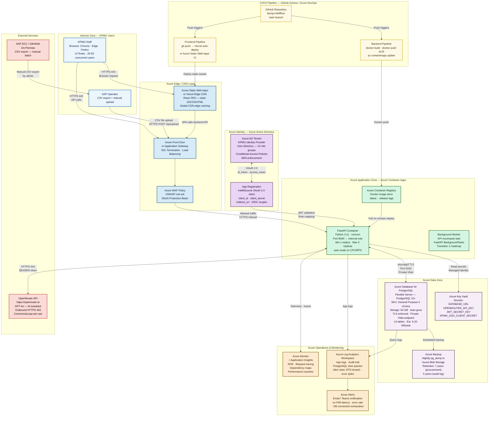

---

## Section 15.1 — Security – Authentication

> Baseline: custom email + password auth (plaintext — pilot only, bcrypt REQUIRED before production).  
> Production: bcrypt (cost factor 12) + JWT (15-min access + 7-day refresh).  
> Target Architecture: KPMG Azure AD SSO via OAuth 2.0 Authorization Code Flow + MFA via Conditional Access.

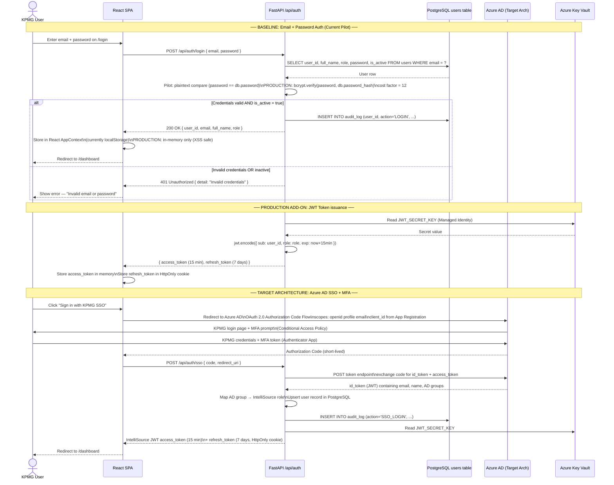

---

## Section 15.2 — Security – Authorization

> Role-Based Access Control (RBAC) with 12 predefined roles.  
> Baseline: role checked at frontend route level only.  
> Production requirement: JWT claims validated server-side on every API call.

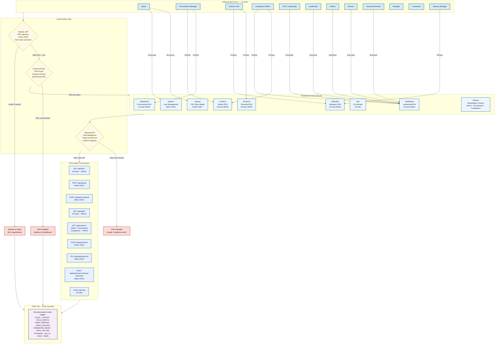

---

## Section 19 — Solution Compliance – Enterprise Architecture Principles

> IntelliSource compliance against 10 KPMG EA Architecture Principles.  
> 8 of 10 compliant. 1 partial (mobile — Transition 1 roadmap). 1 non-compliant with justification (off-the-shelf integration not used; custom API justified by SAP-specific data model).

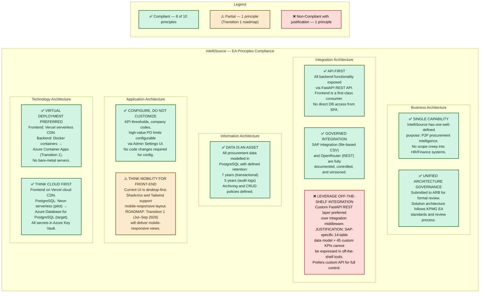

---

## Diagram Index

| # | ARB Section | Mermaid Diagram Type | Status |
|---|---|---|---|
| 1 | 7.1 Business Process (To-Be) | `flowchart TD` — swimlanes | ✅ |
| 2 | 7.2 Business Process (As-Is) | `flowchart TD` — swimlanes + gaps | ✅ |
| 3 | 11.3 Information Architecture – Conceptual Data Model | `erDiagram` — 14 entities | ✅ |
| 4 | 11.4 Information Architecture – Data/CRUD Model | `flowchart LR` — CRUD mapping | ✅ |
| 5 | 12.1 Conceptual/Logical Application Architecture | `flowchart TD` — 5 layers | ✅ |
| 6 | 12.4 Application Architecture – Technology Stack | `flowchart LR` — tech BOM | ✅ |
| 7 | 13.1 Integration Architecture – Solution Context | `flowchart LR` — integration context | ✅ |
| 8 | 14.1 Technology Architecture – Hosting/Deployment (Azure) | `flowchart TD` — Azure zones | ✅ |
| 9 | 15.1 Security – Authentication | `sequenceDiagram` — Baseline + Target | ✅ |
| 10 | 15.2 Security – Authorization | `flowchart TD` — RBAC flow | ✅ |
| 11 | 19. Solution Compliance – EA Principles | `flowchart LR` — compliance status | ✅ |
