```mermaid
flowchart TD

    %% ══════════════════════════════════════════════════════════════
    %%  STYLES
    %% ══════════════════════════════════════════════════════════════
    classDef procStyle  fill:#D6EAF8,stroke:#1A5276,color:#0D2137,stroke-width:2px,rx:6
    classDef vendStyle  fill:#D1F2EB,stroke:#0E6655,color:#0D2137,stroke-width:2px,rx:6
    classDef finStyle   fill:#D5F5E3,stroke:#1E6823,color:#0D2137,stroke-width:2px,rx:6
    classDef leadStyle  fill:#EBD5F7,stroke:#512E5F,color:#0D2137,stroke-width:2px,rx:6
    classDef compStyle  fill:#FADBD8,stroke:#C0392B,color:#0D2137,stroke-width:2px,rx:6
    classDef adminStyle fill:#FDEBD0,stroke:#7D4E05,color:#0D2137,stroke-width:2px,rx:6
    classDef sysStyle   fill:#EBF5FB,stroke:#1565C0,color:#0D2137,stroke-width:2px,rx:6
    classDef dbStyle    fill:#F5EEF8,stroke:#512E5F,color:#0D2137,stroke-width:3px,rx:6
    classDef decStyle   fill:#FEF9E7,stroke:#D4AC0D,color:#0D2137,stroke-width:2px

    %% ══════════════════════════════════════════════════════════════
    %%  1. REQUESTOR / BUSINESS UNIT
    %% ══════════════════════════════════════════════════════════════
    subgraph REQ["👤  Requestor / Business Unit"]
        direction LR
        R1["🔍 Identify\nProcurement Need"]
        R2["📝 Raise Purchase\nRequisition (PR)"]
        R3["📤 Submit PR\nfor Approval"]
        R1 --> R2 --> R3
    end

    %% ══════════════════════════════════════════════════════════════
    %%  2. PROCUREMENT MANAGER
    %% ══════════════════════════════════════════════════════════════
    subgraph PROC["🏢  Procurement Manager"]
        direction LR
        P1{"✅ Review &\nApprove PR?"}
        P2["🤝 Vendor Selection\n& Negotiation"]
        P3["📋 Issue Purchase\nOrder (PO)"]
        P4["📊 Monitor via\nProcurement Dashboard\n• Open PR Aging\n• PO Approval Cycle\n• Amendment Rate\n• High-Value POs"]
        P1 -->|Approved| P2
        P2 --> P3
        P3 --> P4
    end

    %% ══════════════════════════════════════════════════════════════
    %%  3. VENDOR / SUPPLIER
    %% ══════════════════════════════════════════════════════════════
    subgraph VND["🚚  Vendor / Supplier"]
        direction LR
        V1["📩 Acknowledge\nPurchase Order"]
        V2["🏭 Deliver Goods\nor Services"]
        V3["🧾 Submit Invoice\nto Finance Team"]
        V1 --> V2 --> V3
    end

    %% ══════════════════════════════════════════════════════════════
    %%  4. WAREHOUSE / OPERATIONS
    %% ══════════════════════════════════════════════════════════════
    subgraph WHS["📦  Warehouse / Operations"]
        direction LR
        W1["📥 Receive Goods\nat Delivery Point"]
        W2{"🔎 Quality\nInspection"}
        W3["✅ Post Goods\nReceipt (GRN)"]
        W1 --> W2
        W2 -->|Pass| W3
    end

    %% ══════════════════════════════════════════════════════════════
    %%  5. FINANCE / ACCOUNTS PAYABLE
    %% ══════════════════════════════════════════════════════════════
    subgraph FIN["💰  Finance / Accounts Payable Team"]
        direction LR
        F1["📬 Receive &\nLog Vendor Invoice"]
        F2{"⚖️ 3-Way Match\nPO × GRN × Invoice\n(5% tolerance)"}
        F3["✔️ Approve\nInvoice"]
        F4["💳 Schedule &\nProcess Payment"]
        F5["📊 Monitor via\nFinancial Dashboard\n• Invoice Processing Days\n• On-Time Payment Rate\n• Open Invoice Aging\n• 3-Way Match Rate"]
        F1 --> F2
        F2 -->|Matched| F3 --> F4 --> F5
    end

    %% ══════════════════════════════════════════════════════════════
    %%  6. COMPLIANCE OFFICER
    %% ══════════════════════════════════════════════════════════════
    subgraph COMP["🔍  Compliance Officer"]
        direction LR
        C1["🛡️ SOD Conflict Review\n(4 control scenarios:\nPO Create↔Release,\nPO↔GRN, GRN↔Invoice,\nInvoice↔Payment)"]
        C2["📑 Duplicate Invoice\nDetection"]
        C3["⚠️ Anomaly &\nRisk Escalation"]
        C1 --> C3
        C2 --> C3
    end

    %% ══════════════════════════════════════════════════════════════
    %%  7. LEADERSHIP / CXO
    %% ══════════════════════════════════════════════════════════════
    subgraph LEAD["👔  Leadership / CXO"]
        direction LR
        L1["📈 Review Spend,\nSavings & Risk Score\n• Total Spend YTD\n• Negotiation Savings\n• Supply Risk Score"]
        L2["🏪 Vendor Health\n& Concentration\n• Top-3 Concentration\n• Maverick Buy Rate"]
        L3["🎯 Strategic P2P\nDecision Making"]
        L1 --> L2 --> L3
    end

    %% ══════════════════════════════════════════════════════════════
    %%  8. INTELLISOURCE ADMIN
    %% ══════════════════════════════════════════════════════════════
    subgraph ADMIN["⚙️  IntelliSource Admin"]
        direction LR
        A1["📤 Export Data\nfrom SAP ERP\n(PR/PO/GRN/Invoice/Payment)"]
        A2["⬆️ Upload CSV via\nIntelliSource Portal"]
        A3["👥 User Access\nManagement\n(Role-based: 12 roles)"]
        A1 --> A2
    end

    %% ══════════════════════════════════════════════════════════════
    %%  9. INTELLISOURCE ANALYTICS PLATFORM
    %% ══════════════════════════════════════════════════════════════
    subgraph IS["📊  IntelliSource Analytics Platform"]
        direction TB
        IS1[("🗄️ PostgreSQL\nNeon Serverless DB\npo_dump · pr_dump · grn_dump\ninvoice_dump · payment_dump\nvendor_master · change_log")]
        IS2["⚡ KPI Engine\n45 metrics computed\nper company code"]
        ISP["🏢 Procurement\nDashboard\n8 KPIs"]
        ISF["💰 Financial\nDashboard\n10 KPIs"]
        ISL["👔 Leadership\nDashboard\n8 KPIs + P2P Counts"]
        ISV["🚚 Vendor\nDashboard\n8 KPIs"]
        ISU["📐 Utilization\nDashboard\n10 KPIs (CAPEX/OPEX)"]
        IS1 --> IS2
        IS2 --> ISP
        IS2 --> ISF
        IS2 --> ISL
        IS2 --> ISV
        IS2 --> ISU
    end

    %% ══════════════════════════════════════════════════════════════
    %%  MAIN P2P PROCESS FLOW (cross-team handoffs)
    %% ══════════════════════════════════════════════════════════════
    R3 -->|"Submitted\nfor Review"| P1
    P1 -->|"❌ Rejected →\nRevise PR"| R2
    P3 -->|"PO Issued"| V1
    V2 -->|"Goods Arrive\nat Site"| W1
    W2 -->|"❌ Fail →\nReturn to Vendor"| V2
    W3 -->|"GRN Posted"| F1
    V3 -->|"Invoice Received"| F1
    F2 -->|"⚠️ Mismatch →\nQuery Vendor"| V3

    %% ══════════════════════════════════════════════════════════════
    %%  DATA UPLOAD FLOW → INTELLISOURCE
    %% ══════════════════════════════════════════════════════════════
    P3 -.->|"PO data\nexported"| A1
    W3 -.->|"GRN data\nexported"| A1
    F4 -.->|"Payment data\nexported"| A1
    A2 -.->|"Ingested to DB"| IS1

    %% ══════════════════════════════════════════════════════════════
    %%  DASHBOARD ACCESS BY ROLE
    %% ══════════════════════════════════════════════════════════════
    ISP -.->|"Real-time KPIs"| P4
    ISF -.->|"Real-time KPIs"| F5
    ISL -.->|"Real-time KPIs"| L1
    ISV -.->|"Real-time KPIs"| L2
    ISU -.->|"CAPEX/OPEX\nSplit"| L1

    %% ══════════════════════════════════════════════════════════════
    %%  COMPLIANCE MONITORING FEEDS
    %% ══════════════════════════════════════════════════════════════
    IS2 -.->|"SOD conflict\nalerts"| C1
    IS2 -.->|"Duplicate\nflags"| C2
    C3 -.->|"Escalation\nreport"| L3

    %% ══════════════════════════════════════════════════════════════
    %%  STYLE ASSIGNMENT
    %% ══════════════════════════════════════════════════════════════
    class R1,R2,R3 procStyle
    class P2,P3,P4 procStyle
    class P1 decStyle
    class V1,V2,V3 vendStyle
    class W1,W3 vendStyle
    class W2 decStyle
    class F1,F3,F4,F5 finStyle
    class F2 decStyle
    class C1,C2,C3 compStyle
    class L1,L2,L3 leadStyle
    class A1,A2,A3 adminStyle
    class IS1 dbStyle
    class IS2,ISP,ISF,ISL,ISV,ISU sysStyle
```

# IntelliSource — P2P Business Process Diagram (Team & User View)

> **Audience:** Executive / Client · **Scope:** Full Procure-to-Pay lifecycle with IntelliSource overlay  
> **Actors:** 8 teams · **Platform:** IntelliSource (45 KPI metrics, 5 dashboards)

---



---

## Actor Summary

| Actor | Role in P2P | IntelliSource Access |
|---|---|---|
| **Requestor / Business Unit** | Raises Purchase Requisitions | — |
| **Procurement Manager** | Approves PRs, issues POs, negotiates with vendors | Procurement Dashboard (8 KPIs) |
| **Vendor / Supplier** | Acknowledges PO, delivers goods, submits invoice | — |
| **Warehouse / Operations** | Receives goods, quality check, posts GRN | — |
| **Finance / AP Team** | Invoice logging, 3-way match, payment processing | Financial Dashboard (10 KPIs) |
| **Compliance Officer** | SOD conflict detection, duplicate invoice review, anomaly escalation | Vendor + Leadership Dashboards |
| **Leadership / CXO** | Strategic spend review, vendor health, risk monitoring | Leadership Dashboard (8 KPIs + P2P Counts) + Utilization (10 KPIs) |
| **IntelliSource Admin** | SAP data export, CSV upload, user management | All Dashboards + Admin Panel |

## Key Process Handoffs

| From | To | Trigger |
|---|---|---|
| Requestor | Procurement Manager | PR submitted for approval |
| Procurement Manager | Vendor | PO issued |
| Vendor | Warehouse | Goods delivered |
| Warehouse | Finance | GRN posted |
| Vendor | Finance | Invoice submitted |
| Finance | Vendor | 3-way match mismatch (query) |
| Compliance | Leadership | Escalation report (SOD / anomaly) |
| IntelliSource Platform | All role users | Real-time KPI dashboard access |

## IntelliSource Data Flow

```
SAP ERP System
    → CSV Export (PR / PO / GRN / Invoice / Payment / Vendor / Change Log)
        → IntelliSource Upload Portal (Admin)
            → PostgreSQL / Neon DB (10 tables)
                → KPI Engine (45 metrics, per company code)
                    ├── Procurement Dashboard  — 8 KPIs
                    ├── Financial Dashboard    — 10 KPIs
                    ├── Leadership Dashboard   — 8 KPIs + P2P Summary Counts
                    ├── Vendor Dashboard       — 8 KPIs
                    └── Utilization Dashboard  — 10 KPIs (CAPEX / OPEX)
```
